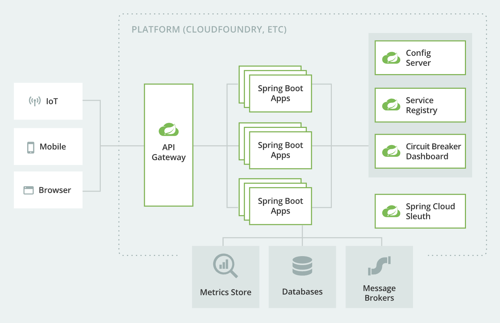

# 101-docker

## Motivation
 
Understand the `JVM` & Non JVM ecosystem comparing:

- Container application running with the JVM support
- Container application running with GraalVM native support
- Container application running with WASM support

And reviewing the scenarios in terms of `CPU` & `Memory` for a financial point of view in the middle term.

## A microservice architecture to be evaluated with Spring Boot applications & GraalVM native capabilities

https://spring.io/microservices

> Microservices are a modern approach to software whereby application code
is delivered in small, manageable pieces, independent of others.

- [x] HTTP Rest communications (A <- B)
- [ ] Database transactions
- [ ] Event driven communications (A -> Event Store)

## References

- https://github.com/graalvm/graalvm-demos
- https://spring.io/blog/2022/09/26/native-support-in-spring-boot-3-0-0-m5
- https://github.com/oktadev/native-java-examples
- https://docs.spring.io/spring-native/docs/current/reference/htmlsingle/
- https://docs.spring.io/spring-boot/docs/current/maven-plugin/reference/htmlsingle/
- https://graalvm.github.io/native-build-tools/latest/
- https://graalvm.github.io/native-build-tools/latest/maven-plugin.html
- https://start.spring.io/
- https://github.com/wagoodman/dive
- https://spring.io/guides/gs/spring-boot-docker/
- https://docs.spring.io/spring-boot/docs/current/maven-plugin/reference/htmlsingle/
- https://console.cloud.google.com/gcr/images/paketo-buildpacks/GLOBAL/bellsoft-liberica
- https://github.com/paketo-buildpacks/bellsoft-liberica
- https://github.com/paketo-buildpacks/java-native-image
- https://spring.io/microservices
- http://more.musl.cc/
- https://docs.docker.com/compose/

## Previous talks

- https://github.com/jabrena/crossing-the-chasm-native-images
